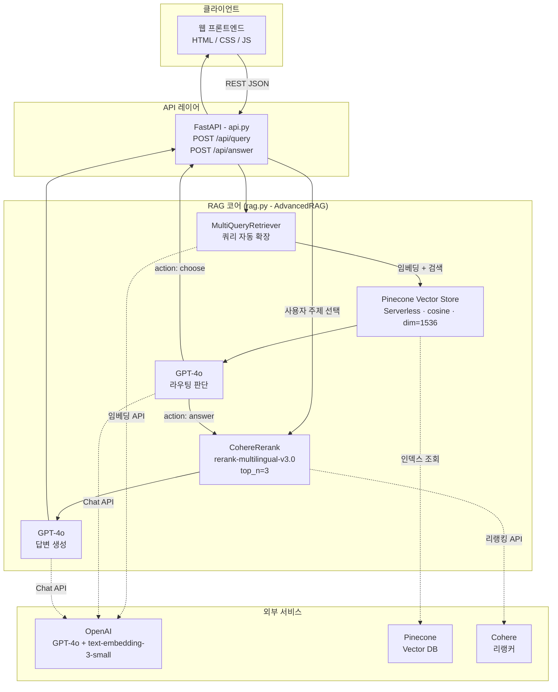

# Curriculum Recommendation Agent

<div align="center">


</div>

**2단계 RAG를 활용한 맞춤형 커리큘럼 추천 AI 에이전트**

---

## 📌 개요

서울특별시교육청 공식 고등학교 교육과정 PDF를 기반으로, 학년별 맞춤형 커리큘럼 정보를 제공하는 **2단계 RAG(Retrieval-Augmented Generation) 에이전트**입니다.

사용자가 학년과 질문을 입력하면, **vector 검색 → Cohere 리랭킹 → GPT-4o 생성** 파이프라인을 통해 PDF 페이지 출처가 명시된 구조화된 답변을 반환합니다. 질문이 포괄적인 경우 LLM 라우터가 자동으로 주제 보기를 제시하고, 구체적인 경우 즉시 답변합니다.

> **입력:** 학년 선택(1·2학년 / 3학년) + 자연어 질문
> **출력:** 마크다운 구조 답변 + PDF 페이지 인용(pg.X)

---

## ✨ 주요 기능

| # | 기능명 | 설명 |
|---|--------|------|
| 1 | **스마트 라우팅** | LLM이 검색 후 질문의 구체성을 판단 - 구체적 질문은 즉시 답변, 포괄적 질문은 3가지 주제 보기 제시 |
| 2 | **2단계 RAG** | Pinecone vector 검색(k=15) 후 Cohere 리랭킹(top 3)으로 정밀한 문서 선별 |
| 3 | **Multi-Query 확장** | 짧거나 모호한 질문을 LLM이 자동으로 다수의 변형 쿼리로 확장해 검색 재현율 향상 |
| 4 | **학년별 메타데이터 필터링** | Pinecone 인덱스의 `grade` 필드로 쿼리 시점에 학년 필터 적용, 교차 학년 혼용 방지 |
| 5 | **페이지 출처 인용** | 모든 답변에 `pg.X` 형식의 인라인 PDF 페이지 출처 포함 |
| 6 | **대화 히스토리 유지** | 세션당 최근 6턴의 대화 내역을 LLM에 전달, 자연스러운 멀티턴 질의응답 지원 |
| 7 | **REST API + 웹 UI** | FastAPI 백엔드(`/api/query`, `/api/answer`)와 HTML/CSS/JS 프론트엔드 제공 |

---

## 🛠 기술 스택

| 분류 | 기술 | 설명 |
|------|------|------|
| **LLM** | OpenAI GPT-4o | 쿼리 라우팅 및 최종 답변 생성 |
| **임베딩** | OpenAI text-embedding-3-small (dim=1536) | 문서 및 쿼리 벡터화 |
| **Vector DB** | Pinecone Serverless (cosine, AWS us-east-1) | 학년 메타데이터 필터링을 지원하는 확장형 유사도 검색 |
| **리랭커** | Cohere rerank-multilingual-v3.0 | 2단계 정밀 리랭킹 |
| **RAG 프레임워크** | LangChain | RAG 파이프라인 오케스트레이션 |
| **Multi-Query** | LangChain MultiQueryRetriever | 검색 재현율 향상을 위한 쿼리 자동 확장 |
| **백엔드 API** | FastAPI + Uvicorn | REST API 서버 |
| **프론트엔드** | HTML / CSS / JavaScript | 웹 채팅 인터페이스 (Replit 배포) |
| **패키지 관리** | [uv](https://docs.astral.sh/uv/) | 빠른 Python 의존성 관리 |
| **PDF 파싱** | PyPDF + RecursiveCharacterTextSplitter | 문서 수집 및 청킹(chunk_size=800, overlap=100) |

---

## 📁 프로젝트 구조

```
curriculum_agent/
├── data/
│   ├── 2026학년도 고등학교 1,2학년 교육과정 편성·운영 방향.pdf   # 1·2학년 교육과정 원본
│   └── 2026학년도 고등학교 3학년 교육과정 편성·운영 방향.pdf    # 3학년 교육과정 원본
├── frontend/
│   └── index.html          # 웹 채팅 UI (Replit 배포용)
├── rag.py                  # 핵심 RAG 파이프라인 (AdvancedRAG 클래스 + CLI 루프)
├── api.py                  # FastAPI 백엔드 서버
├── app.py                  # 진입점 (예비)
├── pyproject.toml          # uv 프로젝트 설정 및 의존성 선언
├── uv.lock                 # 잠긴 의존성 목록
└── .env                    # 환경 변수 (커밋 제외)
```

---

## 🚀 시작하기

### 필수 조건

- Python 3.11 이상
- [uv](https://docs.astral.sh/uv/) 패키지 매니저

```bash
# uv 설치 (macOS / Linux)
curl -LsSf https://astral.sh/uv/install.sh | sh

# uv 설치 (Windows PowerShell)
powershell -ExecutionPolicy ByPass -c "irm https://astral.sh/uv/install.ps1 | iex"
```

### 설치

```bash
git clone https://github.com/vosnuev/curriculum_agent.git
cd curriculum_agent
uv sync
```

### 환경 변수

프로젝트 루트에 `.env` 파일을 생성하세요:

```env
OPENAI_API_KEY=sk-...
PINECONE_API_KEY=...
PINECONE_INDEX_NAME=school-curriculum
COHERE_API_KEY=...
```

| 변수명 | 설명 |
|--------|------|
| `OPENAI_API_KEY` | OpenAI API 키 (GPT-4o + text-embedding-3-small 사용) |
| `PINECONE_API_KEY` | Pinecone API 키 |
| `PINECONE_INDEX_NAME` | Pinecone 인덱스 이름 (기본값: `school-curriculum`) |
| `COHERE_API_KEY` | Cohere API 키 (rerank-multilingual-v3.0 사용) |

### 문서 인덱싱 (최초 1회)

`rag.py`의 `__main__` 블록에서 `ingest_documents` 주석을 해제한 후 실행:

```bash
uv run python rag.py
```

인덱싱 완료 후 다시 주석 처리하세요.

### CLI 실행

```bash
uv run python rag.py
```

### API 서버 실행

```bash
uv run uvicorn api:app --reload --port 8000
```

외부 접속이 필요한 경우 [ngrok](https://ngrok.com)을 사용해 터널링 후 `frontend/index.html`의 `API_BASE`를 업데이트하세요:

```bash
ngrok http 8000
# 발급된 https://xxxx.ngrok-free.app URL을 index.html의 API_BASE에 설정
```

**API 엔드포인트:**

| 메서드 | 엔드포인트 | 설명 |
|--------|------------|------|
| `GET` | `/health` | 서버 상태 확인 |
| `POST` | `/api/query` | 문서 검색 및 라우팅 판단 → `action` + 선택지(`topics`) 반환 |
| `POST` | `/api/answer` | 리랭킹 후 구조화된 마크다운 답변 생성 (페이지 출처 포함) |

---

## 🔄 사용 흐름


---

## 🏗 아키텍처



**RAG 2단계 파이프라인 (선형 뷰):**

```
사용자 쿼리
    │
    ▼
[1단계] Multi-Query 확장 ── GPT-4o가 N개 변형 쿼리 생성
    │
    ▼
[2단계] Pinecone Vector 검색 ── k=15, 학년(grade) 메타데이터 필터
    │
    ▼
[3단계] LLM 라우팅 판단 ── action: "answer" | action: "choose"
    │
    ├─ "choose" → 주제 보기 제시 → 사용자 선택
    │
    ▼
[4단계] Cohere 리랭킹 ── 전체 검색 결과를 선택 주제로 재정렬 → top 3
    │
    ▼
[5단계] GPT-4o 답변 생성 ── 마크다운 구조 + pg.X 출처 인용
    │
    ▼
최종 답변 반환
```

---

## 🧩 RAG 파이프라인 상세 - 무엇을, 어떻게, 왜

### 1. 원본 문서

| 항목 | 내용 |
|---|---|
| 출처 | 서울특별시교육청 - 2026학년도 고등학교 교육과정 편성·운영 방향 |
| 형식 | PDF 2종 (1·2학년용 / 3학년용) |
| 성격 | 조·항 중심 행정 지침 + 표(이수학점·시간 배당) 다수 |

- **문서 특성이 이후 모든 선택을 결정** - 조항이 짧고 표가 많으며, 학년별로 적용 규정이 다름

---

### 2. 적재(Ingest) - `PyPDFLoader` → 청킹 → 메타데이터

```python
loader   = PyPDFLoader(file_path)
splitter = RecursiveCharacterTextSplitter(
    chunk_size=800, chunk_overlap=100,
    separators=["\n\n", "\n", ".", " ", ""],
)
split.metadata["grade"] = "3" if "3학년" in file_path else "1,2"
```

**① 로더 - 왜 `PyPDFLoader`인가**

- 페이지 단위 로드 → `metadata["page"]` **보존**
- 이 값이 곧 답변의 `pg.X` 출처 → **페이지 정보를 잃는 로더면 출처 인용 기능 자체가 불가능**
- 즉 로더 선택은 파싱 편의가 아니라 **제품 요구사항(출처 표기)이 결정**

**② 청킹 - `RecursiveCharacterTextSplitter`**

| 파라미터 | 값 | 근거 |
|---|---|---|
| 분할 방식 | 재귀 (문단 → 줄 → 문장 → 단어) | 큰 경계부터 시도해 **의미 단위 보존**. 고정 길이 절단은 표·조항 중간을 자름 |
| `chunk_size` | 800 | 지침 문서는 조·항이 짧음. **크면** 한 청크에 여러 주제가 섞여 리랭킹 정밀도 하락, **작으면** 표 하나가 쪼개짐 |
| `chunk_overlap` | 100 (12.5 %) | 경계에 걸친 조항이 양쪽 청크에 모두 남도록 → **경계 누락 방지** |
| `separators` | `\n\n → \n → . → " " → ""` | 문단 경계를 최우선, 마지막에야 무조건 절단 |

> 위 값은 문서 특성에 맞춘 **설계 판단**이며, 파라미터 스윕으로 최적값을 탐색한 결과는 아님.

**③ 메타데이터 - `grade` 주입이 핵심**

- 파일명의 `"3학년"` 포함 여부로 모든 split에 `grade` 부착
- **왜 필요한가** - 1·2학년과 3학년은 **적용 교육과정 자체가 다름**. 섞이면 3학년 질문에 1·2학년 조항이 인용되어 **사실상 오답**
- **왜 벡터로 못 푸는가** - 두 문서는 표현이 거의 동일("교육과정 편성·운영")하여 임베딩 거리로 구분 불가 → **하드 필터가 유일한 해법**

---

### 3. 임베딩 - `text-embedding-3-small` (1536차원)

| 항목 | 값 | 근거 |
|---|---|---|
| 모델 | `text-embedding-3-small` | 한국어 행정문서 검색에 충분한 성능, `large` 대비 **비용·지연 이점** |
| 차원 | 1536 | Pinecone 인덱스 `dimension`과 **반드시 일치** |
| 거리 | cosine | 문서 길이 편차의 영향을 줄이고 **방향 유사도**만 비교 |

---

### 4. 벡터 저장소 - Pinecone Serverless

```python
self.pc.create_index(
    name="school-curriculum", dimension=1536, metric="cosine",
    spec=ServerlessSpec(cloud="aws", region="us-east-1"),
)
```

- 기동 시 `list_indexes()`로 존재 확인 후 **없을 때만 생성** → 재실행 안전(멱등)
- **왜 서버리스** - 문서 2종 규모에 상시 노드는 과투자. 사용량 기반 과금이 적합
- **왜 Pinecone** - `grade` 같은 메타데이터 필터를 **쿼리 시점에** 적용 가능한 것이 결정적 (§2-③의 요구사항)

---

### 5. 검색 - 왜 굳이 2단계인가

**문제 - 단일 벡터 검색은 재현율과 정밀도를 동시에 못 잡음**

| `k`를 작게 | `k`를 크게 |
|---|---|
| 정답 청크를 놓침 (**재현율 ↓**) | 무관한 청크가 컨텍스트를 오염, 토큰 낭비 (**정밀도 ↓**) |

**해법 - 목적이 다른 두 단계로 분리**

| 단계 | 목적 | 수단 | 설정 |
|---|---|---|---|
| **1단계** | **재현율** - 일단 넓게 건진다 | Pinecone + `grade` 필터 + MultiQuery | `k=15` |
| **2단계** | **정밀도** - 좁혀서 고른다 | Cohere `rerank-multilingual-v3.0` | `top_n=3` |

**MultiQueryRetriever를 쓴 이유**

- 사용자는 `"창체"`, 문서는 `"창의적 체험활동"` - **어휘 불일치로 검색 실패**
- LLM이 원 질문을 여러 변형 쿼리로 확장 → 각각 검색 후 합집합 → 재현율 확보

**Cohere Rerank를 쓴 이유**

- 임베딩 검색은 **bi-encoder** - 쿼리와 문서를 따로 인코딩해 미세한 관련성 구분이 약함
- 리랭커는 **cross-encoder** - 쿼리·문서를 **함께** 보고 점수화 → 정밀도가 높음
- 문서·질의가 한국어이므로 `multilingual` 계열 선택
- 주제 보기를 고른 경우 재랭크 쿼리를 `topic_title + query`로 구성 → **사용자 선택을 재랭킹 신호로 재주입**
- 리랭크 결과가 비면 `all_docs[:3]`로 **폴백** (빈 답변 방지)

---

### 6. 라우팅 - LLM이 검색 "뒤에" 개입하는 이유

**문제** - `"교육과정 알려줘"` 같은 포괄 질문은 어떤 청크를 골라도 부분적으로만 맞음

**해법** - 검색 결과를 본 뒤 LLM이 질문의 구체성을 판정

| 판정 | 조건 | 동작 |
|---|---|---|
| `answer` | 학교유형·과목명·수치 등 **명확한 키워드** 존재 / 답이 1~2곳에 집중 / 단순 사실 확인형 | 보기 없이 즉시 답변 |
| `choose` | 여러 범주에 걸침 (일반고·특목고·자율고·특성화고 등) / 질문이 짧고 모호 | **서로 다른 범주** 보기 3개 제시 |

- **왜 검색 "후"인가** - 문서에 실제로 무엇이 있는지 봐야 **유효한 보기**를 만들 수 있음. 검색 전에 판단하면 문서에 없는 보기를 제시하게 됨
- 보기 제약을 프롬프트에 명시 - *"비슷한 표현이나 같은 개념을 다른 말로 쓴 보기는 절대 금지"*
- 출력은 **JSON 강제** + 코드펜스 제거 후 정규식으로 `{...}` 추출 → LLM이 설명을 덧붙여도 파싱 성공

---

### 7. 생성 - `gpt-4o`, `temperature=0`

| 결정 | 근거 |
|---|---|
| `temperature=0` | 행정 지침 QA는 창의성이 아니라 **재현성**이 필요. 같은 질문에 같은 답 |
| 고정 마크다운 스키마 | `핵심 답변` → `섹션 \| pg.X` → `주의사항` 순서 강제 → 답변 형태가 매번 흔들리지 않음 |
| 표 강제 | 비교·목록 정보는 반드시 마크다운 표로 → 이수학점·시간 배당 같은 수치 가독성 확보 |
| 출처 표기 | `doc.metadata["page"] + 1` - 0-index를 **사람이 보는 페이지 번호**로 변환 |
| 환각 억제 | *"문서에 없는 내용은 추측하지 말 것"* 명시 |
| 대화 맥락 | 최근 **6턴**만 전달 → 멀티턴 일관성과 토큰 비용의 절충 |

---

### 8. API 설계 - 왜 엔드포인트를 2개로 쪼갰나

| 엔드포인트 | 역할 | 반환 |
|---|---|---|
| `POST /api/query` | 검색 + 라우팅 판정 | `action`, `topics`, `cache_key` |
| `POST /api/answer` | 리랭킹 + 답변 생성 | `answer` |

- 보기를 제시하고 **사용자가 고르는 사이**에 같은 검색을 두 번 하면 낭비
- 검색 결과를 `md5(grade:query)` 키로 캐시하고 `cache_key`만 넘김 → 2차 호출에서 **재검색 없이 재사용**
- 캐시 미스 시 재검색 **폴백** 존재 → 만료돼도 실패하지 않음

---

### 9. 알려진 한계

| 항목 | 내용 |
|---|---|
| 캐시 | `_doc_cache`가 프로세스 메모리 `dict` - 재시작 시 소실, 다중 워커 **미공유**, TTL·상한 없음 |
| CORS | `allow_origins=["*"]` - 데모 목적. 배포 시 도메인 제한 필요 |
| 평가 | 검색 품질 **정량 평가 미실시** (RAGAS 등 지표 없음) |
| 청킹 | 파라미터가 설계 판단 기반. 스윕으로 검증한 최적값 아님 |
| 진입점 | `app.py`가 빈 파일 (예비 슬롯) |

---

## 🎯 습득 기술 및 역량

| 분류 | 기술 | 적용 내용 |
|------|------|-----------|
| **RAG 파이프라인 설계** | 2단계 검색 아키텍처 | Pinecone vector 검색(k=15)과 Cohere 리랭킹(top 3)을 분리해 재현율과 정밀도를 단계적으로 최적화 |
| **LLM 통합** | GPT-4o + LangChain | 쿼리 라우팅, Multi-Query 확장, 구조화된 답변 생성 등 다중 역할의 LLM 체인 구성 |
| **Vector DB 운용** | Pinecone Serverless | cosine 유사도, dim=1536, 학년별 메타데이터 필터링을 활용한 인덱스 설계 및 쿼리 최적화 |
| **프롬프트 엔지니어링** | 멀티롤 프롬프트 | JSON 출력 라우팅 분류기 및 고정 마크다운 스키마 답변 생성기 프롬프트 설계 |
| **에이전틱 라우팅** | 검색 후 LLM 결정 레이어 | 검색 결과를 바탕으로 직접 답변과 인터랙티브 주제 선택 중 동적 분기 |
| **Multi-Query 검색** | LangChain MultiQueryRetriever | 짧거나 모호한 쿼리를 자동 확장해 vector 검색 재현율 향상 |
| **API 설계** | FastAPI 2-엔드포인트 구조 | 검색·라우팅(`/api/query`)과 생성(`/api/answer`)을 분리한 캐시 활용 아키텍처 |
| **문서 수집 및 전처리** | PyPDFLoader + 청킹 | chunk_size=800 / overlap=100, 문서별 학년 메타데이터 태깅 |
| **대화 메모리** | 롤링 히스토리 | 세션당 최근 6턴 대화 내역을 LLM에 전달해 멀티턴 응답 일관성 유지 |
| **의존성 관리** | uv + pyproject.toml | 재현 가능하고 빠른 Python 환경 구성 |

---

## 📄 라이선스

이 프로젝트는 **MIT License** 하에 배포됩니다.

**출처 문서:**
- 서울특별시교육청, *2026학년도 고등학교 1·2학년 교육과정 편성·운영 방향* (2025)
- 서울특별시교육청, *2026학년도 고등학교 3학년 교육과정 편성·운영 방향* (2025)

> `data/` 폴더의 PDF 문서는 서울특별시교육청의 공식 발간 자료이며, 모든 교육과정 정보는 해당 문서에서 직접 인용됩니다.
