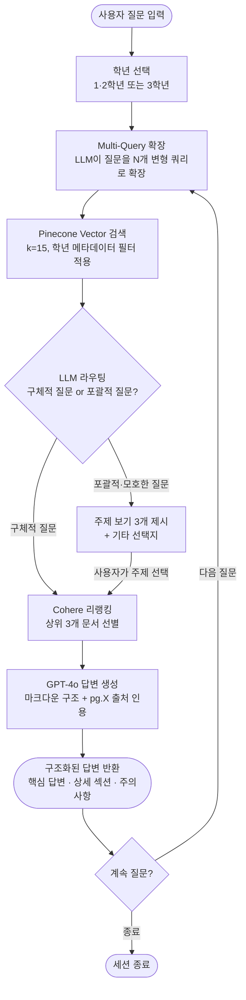

# Curriculum Recommendation Agent

<div align="center">


</div>

**2단계 RAG를 활용한 맞춤형 커리큘럼 추천 AI 에이전트**

---

## 📌 개요

서울특별시교육청 공식 고등학교 교육과정 PDF를 기반으로, 학년별 맞춤형 커리큘럼 정보를 제공하는 **2단계 RAG(Retrieval-Augmented Generation) 에이전트**입니다.

사용자가 학년과 질문을 입력하면, **vector 검색 → Cohere 리랭킹 → GPT-4o 생성** 파이프라인을 통해 PDF 페이지 출처가 명시된 구조화된 답변을 반환합니다. 질문이 포괄적인 경우 LLM 라우터가 자동으로 주제 보기를 제시하고, 구체적인 경우 즉시 답변합니다.

> **입력:** 학년 선택(1·2학년 / 3학년) + 자연어 질문
> **출력:** 마크다운 구조 답변 + PDF 페이지 인용(pg.X)

---

## ✨ 주요 기능

| # | 기능명 | 설명 |
|---|--------|------|
| 1 | **스마트 라우팅** | LLM이 검색 후 질문의 구체성을 판단 — 구체적 질문은 즉시 답변, 포괄적 질문은 3가지 주제 보기 제시 |
| 2 | **2단계 RAG** | Pinecone vector 검색(k=15) 후 Cohere 리랭킹(top 3)으로 정밀한 문서 선별 |
| 3 | **Multi-Query 확장** | 짧거나 모호한 질문을 LLM이 자동으로 다수의 변형 쿼리로 확장해 검색 재현율 향상 |
| 4 | **학년별 메타데이터 필터링** | Pinecone 인덱스의 `grade` 필드로 쿼리 시점에 학년 필터 적용, 교차 학년 혼용 방지 |
| 5 | **페이지 출처 인용** | 모든 답변에 `pg.X` 형식의 인라인 PDF 페이지 출처 포함 |
| 6 | **대화 히스토리 유지** | 세션당 최근 6턴의 대화 내역을 LLM에 전달, 자연스러운 멀티턴 질의응답 지원 |
| 7 | **REST API + 웹 UI** | FastAPI 백엔드(`/api/query`, `/api/answer`)와 HTML/CSS/JS 프론트엔드 제공 |

---

## 🛠 기술 스택

| 분류 | 기술 | 설명 |
|------|------|------|
| **LLM** | OpenAI GPT-4o | 쿼리 라우팅 및 최종 답변 생성 |
| **임베딩** | OpenAI text-embedding-3-small (dim=1536) | 문서 및 쿼리 벡터화 |
| **Vector DB** | Pinecone Serverless (cosine, AWS us-east-1) | 학년 메타데이터 필터링을 지원하는 확장형 유사도 검색 |
| **리랭커** | Cohere rerank-multilingual-v3.0 | 2단계 정밀 리랭킹 |
| **RAG 프레임워크** | LangChain | RAG 파이프라인 오케스트레이션 |
| **Multi-Query** | LangChain MultiQueryRetriever | 검색 재현율 향상을 위한 쿼리 자동 확장 |
| **백엔드 API** | FastAPI + Uvicorn | REST API 서버 |
| **프론트엔드** | HTML / CSS / JavaScript | 웹 채팅 인터페이스 (Replit 배포) |
| **패키지 관리** | [uv](https://docs.astral.sh/uv/) | 빠른 Python 의존성 관리 |
| **PDF 파싱** | PyPDF + RecursiveCharacterTextSplitter | 문서 수집 및 청킹(chunk_size=800, overlap=100) |

---

## 📁 프로젝트 구조

```
curriculum_agent/
├── data/
│   ├── 2026학년도 고등학교 1,2학년 교육과정 편성·운영 방향.pdf   # 1·2학년 교육과정 원본
│   └── 2026학년도 고등학교 3학년 교육과정 편성·운영 방향.pdf    # 3학년 교육과정 원본
├── frontend/
│   └── index.html          # 웹 채팅 UI (Replit 배포용)
├── rag.py                  # 핵심 RAG 파이프라인 (AdvancedRAG 클래스 + CLI 루프)
├── api.py                  # FastAPI 백엔드 서버
├── app.py                  # 진입점 (예비)
├── pyproject.toml          # uv 프로젝트 설정 및 의존성 선언
├── uv.lock                 # 잠긴 의존성 목록
└── .env                    # 환경 변수 (커밋 제외)
```

---

## 🚀 시작하기

### 필수 조건

- Python 3.11 이상
- [uv](https://docs.astral.sh/uv/) 패키지 매니저

```bash
# uv 설치 (macOS / Linux)
curl -LsSf https://astral.sh/uv/install.sh | sh

# uv 설치 (Windows PowerShell)
powershell -ExecutionPolicy ByPass -c "irm https://astral.sh/uv/install.ps1 | iex"
```

### 설치

```bash
git clone https://github.com/vosnuev/curriculum_agent.git
cd curriculum_agent
uv sync
```

### 환경 변수

프로젝트 루트에 `.env` 파일을 생성하세요:

```env
OPENAI_API_KEY=sk-...
PINECONE_API_KEY=...
PINECONE_INDEX_NAME=school-curriculum
COHERE_API_KEY=...
```

| 변수명 | 설명 |
|--------|------|
| `OPENAI_API_KEY` | OpenAI API 키 (GPT-4o + text-embedding-3-small 사용) |
| `PINECONE_API_KEY` | Pinecone API 키 |
| `PINECONE_INDEX_NAME` | Pinecone 인덱스 이름 (기본값: `school-curriculum`) |
| `COHERE_API_KEY` | Cohere API 키 (rerank-multilingual-v3.0 사용) |

### 문서 인덱싱 (최초 1회)

`rag.py`의 `__main__` 블록에서 `ingest_documents` 주석을 해제한 후 실행:

```bash
uv run python rag.py
```

인덱싱 완료 후 다시 주석 처리하세요.

### CLI 실행

```bash
uv run python rag.py
```

### API 서버 실행

```bash
uv run uvicorn api:app --reload --port 8000
```

외부 접속이 필요한 경우 [ngrok](https://ngrok.com)을 사용해 터널링 후 `frontend/index.html`의 `API_BASE`를 업데이트하세요:

```bash
ngrok http 8000
# 발급된 https://xxxx.ngrok-free.app URL을 index.html의 API_BASE에 설정
```

**API 엔드포인트:**

| 메서드 | 엔드포인트 | 설명 |
|--------|------------|------|
| `GET` | `/health` | 서버 상태 확인 |
| `POST` | `/api/query` | 문서 검색 및 라우팅 판단 → `action` + 선택지(`topics`) 반환 |
| `POST` | `/api/answer` | 리랭킹 후 구조화된 마크다운 답변 생성 (페이지 출처 포함) |

---

## 🔄 사용 흐름



---

## 🏗 아키텍처


**RAG 2단계 파이프라인 (선형 뷰):**

```
사용자 쿼리
    │
    ▼
[1단계] Multi-Query 확장 ── GPT-4o가 N개 변형 쿼리 생성
    │
    ▼
[2단계] Pinecone Vector 검색 ── k=15, 학년(grade) 메타데이터 필터
    │
    ▼
[3단계] LLM 라우팅 판단 ── action: "answer" | action: "choose"
    │
    ├─ "choose" → 주제 보기 제시 → 사용자 선택
    │
    ▼
[4단계] Cohere 리랭킹 ── 전체 검색 결과를 선택 주제로 재정렬 → top 3
    │
    ▼
[5단계] GPT-4o 답변 생성 ── 마크다운 구조 + pg.X 출처 인용
    │
    ▼
최종 답변 반환
```

---

## 🎯 습득 기술 및 역량

| 분류 | 기술 | 적용 내용 |
|------|------|-----------|
| **RAG 파이프라인 설계** | 2단계 검색 아키텍처 | Pinecone vector 검색(k=15)과 Cohere 리랭킹(top 3)을 분리해 재현율과 정밀도를 단계적으로 최적화 |
| **LLM 통합** | GPT-4o + LangChain | 쿼리 라우팅, Multi-Query 확장, 구조화된 답변 생성 등 다중 역할의 LLM 체인 구성 |
| **Vector DB 운용** | Pinecone Serverless | cosine 유사도, dim=1536, 학년별 메타데이터 필터링을 활용한 인덱스 설계 및 쿼리 최적화 |
| **프롬프트 엔지니어링** | 멀티롤 프롬프트 | JSON 출력 라우팅 분류기 및 고정 마크다운 스키마 답변 생성기 프롬프트 설계 |
| **에이전틱 라우팅** | 검색 후 LLM 결정 레이어 | 검색 결과를 바탕으로 직접 답변과 인터랙티브 주제 선택 중 동적 분기 |
| **Multi-Query 검색** | LangChain MultiQueryRetriever | 짧거나 모호한 쿼리를 자동 확장해 vector 검색 재현율 향상 |
| **API 설계** | FastAPI 2-엔드포인트 구조 | 검색·라우팅(`/api/query`)과 생성(`/api/answer`)을 분리한 캐시 활용 아키텍처 |
| **문서 수집 및 전처리** | PyPDFLoader + 청킹 | chunk_size=800 / overlap=100, 문서별 학년 메타데이터 태깅 |
| **대화 메모리** | 롤링 히스토리 | 세션당 최근 6턴 대화 내역을 LLM에 전달해 멀티턴 응답 일관성 유지 |
| **의존성 관리** | uv + pyproject.toml | 재현 가능하고 빠른 Python 환경 구성 |

---

## 📄 라이선스

이 프로젝트는 **MIT License** 하에 배포됩니다.

**출처 문서:**
- 서울특별시교육청, *2026학년도 고등학교 1·2학년 교육과정 편성·운영 방향* (2025)
- 서울특별시교육청, *2026학년도 고등학교 3학년 교육과정 편성·운영 방향* (2025)

> `data/` 폴더의 PDF 문서는 서울특별시교육청의 공식 발간 자료이며, 모든 교육과정 정보는 해당 문서에서 직접 인용됩니다.
