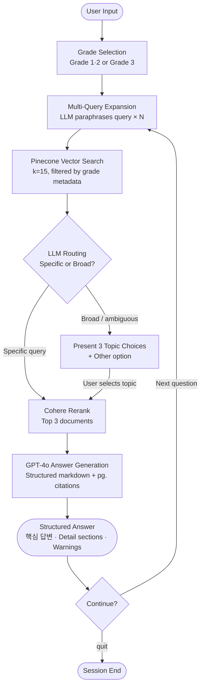
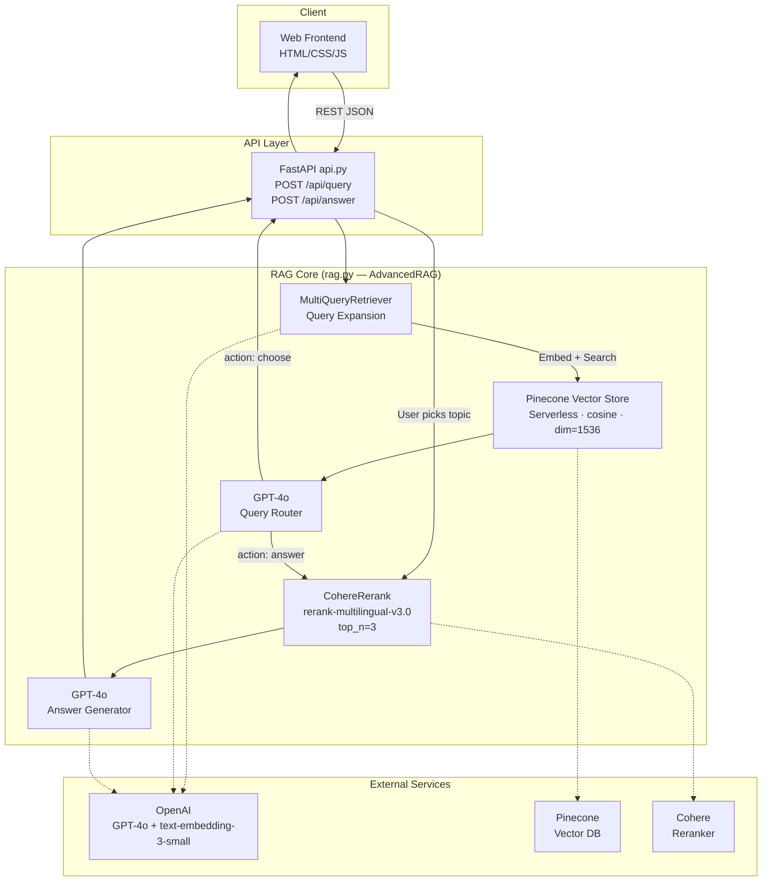

# Curriculum Recommendation Agent

<div align="center">


</div>

---

## 📌 Overview

A **2-stage RAG (Retrieval-Augmented Generation) agent** that answers questions about Seoul high school curriculum documents with precise PDF page citations.

The agent ingests official curriculum PDFs, indexes them into a Pinecone vector store, and serves personalized answers through a two-step pipeline: **vector search → Cohere reranking → GPT-4o generation**. A smart routing layer decides whether to answer directly or present topic choices when the query is broad or ambiguous.

> **Input:** User's grade level + natural language question  
> **Output:** Structured study plan / curriculum answer with PDF page citations

---

## ✨ Features

| # | Feature | Description |
|---|---------|-------------|
| 1 | **Smart Routing** | LLM classifies each query post-retrieval — answers directly when specific, presents 3 topic choices when the query is broad or ambiguous |
| 2 | **2-Stage RAG** | Vector search (Pinecone, k=15) followed by Cohere reranking (top 3) for high-precision context selection |
| 3 | **Multi-Query Expansion** | Short or ambiguous queries are automatically paraphrased into multiple queries by the LLM to maximize recall |
| 4 | **Grade-Based Metadata Filtering** | Documents are indexed with a `grade` field; Pinecone filters at query time so grade 1–2 queries never surface grade 3 content |
| 5 | **Structured Answers with Page Citations** | Every response follows a fixed markdown schema with inline `pg.X` references back to the source PDF |
| 6 | **Conversation History** | The last 6 turns are maintained per session, enabling natural follow-up questions |
| 7 | **REST API + Web UI** | FastAPI backend with `/api/query` and `/api/answer` endpoints; HTML/CSS/JS frontend deployable on Replit |

---

## 🛠 Tech Stack

| Category | Technology | Purpose |
|----------|-----------|---------|
| **LLM** | OpenAI GPT-4o | Query routing, answer generation |
| **Embedding** | OpenAI text-embedding-3-small (dim=1536) | Document and query vectorization |
| **Vector Database** | Pinecone Serverless (cosine, AWS us-east-1) | Scalable similarity search with metadata filtering |
| **Reranker** | Cohere rerank-multilingual-v3.0 | 2nd-stage precision reranking |
| **RAG Framework** | LangChain (langchain, langchain-openai, langchain-pinecone, langchain-cohere) | Pipeline orchestration |
| **Multi-Query** | LangChain MultiQueryRetriever | Query expansion for improved recall |
| **Backend API** | FastAPI + Uvicorn | REST API server |
| **Frontend** | HTML / CSS / JavaScript | Web chat interface (Replit) |
| **Package Manager** | [uv](https://docs.astral.sh/uv/) | Fast Python dependency management |
| **PDF Parsing** | PyPDF + RecursiveCharacterTextSplitter | Document ingestion and chunking |

---

## 📁 Project Structure

```
curriculum_agent/
├── data/
│   ├── 2026학년도 고등학교 1,2학년 교육과정 편성·운영 방향.pdf
│   └── 2026학년도 고등학교 3학년 교육과정 편성·운영 방향.pdf
├── frontend/
│   └── index.html          # Web frontend (Replit deployment)
├── rag.py                  # Core RAG pipeline (AdvancedRAG class + CLI loop)
├── api.py                  # FastAPI backend server
├── pyproject.toml          # uv project config & dependencies
├── uv.lock                 # Locked dependency manifest
└── .env                    # Environment variables (not committed)
```

---

## 🚀 Getting Started

### Prerequisites

- Python 3.11+
- [uv](https://docs.astral.sh/uv/) package manager

```bash
# Install uv (macOS / Linux)
curl -LsSf https://astral.sh/uv/install.sh | sh

# Install uv (Windows PowerShell)
powershell -ExecutionPolicy ByPass -c "irm https://astral.sh/uv/install.ps1 | iex"
```

### Installation

```bash
git clone https://github.com/vosnuev/curriculum_agent.git
cd curriculum_agent
uv sync
```

### Environment Variables

Create a `.env` file in the project root:

```env
OPENAI_API_KEY=sk-...
PINECONE_API_KEY=...
PINECONE_INDEX_NAME=school-curriculum
COHERE_API_KEY=...
```

| Variable | Description |
|----------|-------------|
| `OPENAI_API_KEY` | OpenAI API key (GPT-4o + text-embedding-3-small) |
| `PINECONE_API_KEY` | Pinecone API key |
| `PINECONE_INDEX_NAME` | Pinecone index name (default: `school-curriculum`) |
| `COHERE_API_KEY` | Cohere API key (rerank-multilingual-v3.0) |

### Index Documents (First Run Only)

Uncomment `ingest_documents` in the `__main__` block of `rag.py`, then run:

```bash
uv run python rag.py
```

Re-comment after indexing is complete.

### Run CLI

```bash
uv run python rag.py
```

### Run API Server

```bash
uv run uvicorn api:app --reload --port 8000
```

Set `API_BASE` in `frontend/index.html` to your backend URL. For external access, use [ngrok](https://ngrok.com):

```bash
ngrok http 8000
# Copy the https://xxxx.ngrok-free.app URL into index.html API_BASE
```

**API Endpoints:**

| Method | Endpoint | Description |
|--------|----------|-------------|
| `GET` | `/health` | Health check |
| `POST` | `/api/query` | Retrieve docs, classify query → return `action` + optional `topics` |
| `POST` | `/api/answer` | Rerank + generate structured answer with page citations |

---

## 🔄 Usage Flow



---

## 🏗 Architecture



**RAG Pipeline (linear view):**

```
Query
  │
  ▼
[Multi-Query Expansion]  — GPT-4o generates N paraphrased queries
  │
  ▼
[Pinecone Vector Search]  — k=15, metadata filter: grade
  │
  ▼
[LLM Query Routing]  — action: "answer" | action: "choose"
  │
  ├─ "choose" → present topics → user selects
  │
  ▼
[Cohere Rerank]  — re-rank all docs by selected topic → top 3
  │
  ▼
[GPT-4o Answer Generation]  — structured markdown + pg.X citations
  │
  ▼
Response
```

---

## 🎯 Skills Demonstrated

| Skill Area | Implementation Detail |
|-----------|----------------------|
| **RAG Pipeline Design** | 2-stage retrieval: Pinecone vector search (k=15) → Cohere reranking (top 3); separates recall from precision |
| **LLM Integration** | GPT-4o for query routing, multi-query expansion, and structured answer generation via LangChain |
| **Vector Database** | Pinecone Serverless index with cosine similarity, dimension 1536, and grade-based metadata filtering |
| **Prompt Engineering** | Multi-role prompts: routing classifier (JSON output), answer generator (fixed markdown schema with citation format) |
| **Agentic Routing** | Post-retrieval LLM decision layer that branches between direct answer and interactive topic selection |
| **Multi-Query Retrieval** | LangChain `MultiQueryRetriever` automatically expands short/ambiguous queries to improve vector search recall |
| **API Design** | FastAPI two-endpoint architecture decouples retrieval/routing (`/api/query`) from generation (`/api/answer`) |
| **Document Ingestion** | PDF parsing with `PyPDFLoader`, chunk size 800 / overlap 100, metadata tagging per document |
| **Conversation Memory** | Rolling 6-turn history passed to LLM for coherent multi-turn sessions |
| **Dependency Management** | `uv` + `pyproject.toml` for reproducible, fast Python environment setup |

---

## 📄 License

This project is licensed under the **MIT License**.

**Source Documents:**
- Seoul Metropolitan Office of Education, *2026 High School Grade 1·2 Curriculum Planning and Operation Guidelines* (2025)
- Seoul Metropolitan Office of Education, *2026 High School Grade 3 Curriculum Planning and Operation Guidelines* (2025)

> The PDF documents in `data/` are official publications of the Seoul Metropolitan Office of Education (서울특별시교육청). All curriculum information is sourced directly from these documents.
